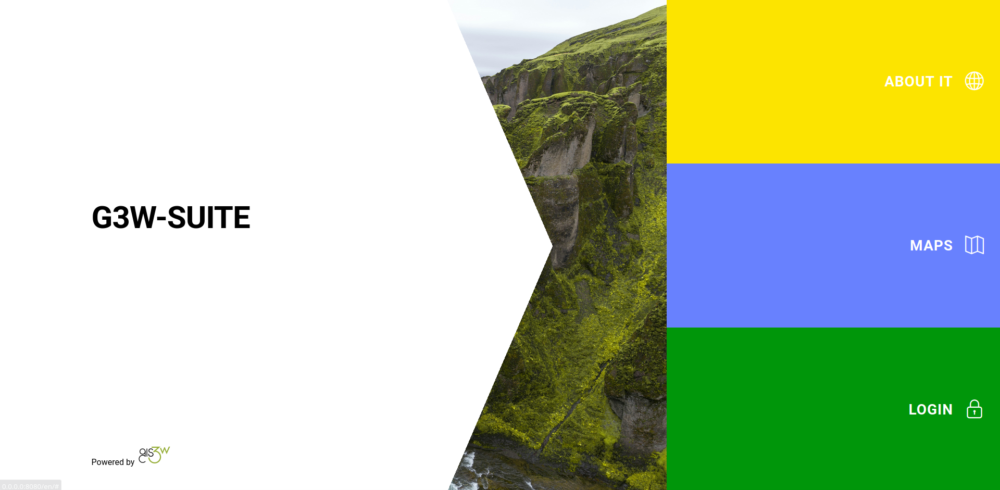

# G3W-SUITE WebGIS

[](https://github.com/g3w-suite/g3w-suite-docker/actions/workflows/build_and_push_main_image.yml)
[](https://github.com/g3w-suite/g3w-suite-docker/actions/workflows/build_and_push_deps_ltr.yml)

This repository contains scripts and recipes for deploy of the G3W-SUITE web-gis application with Docker and Docker compose, customized
for EOIntelligence.

## Deploy

Follow steps to deploy G3W-SUITE on Ubuntu (22.04)

### Configuration 

Create a file `.env` (or copy `.env.example` and rename it in `.env`) and place it in the `deployment` directory, the file
will contain the database credentials (change `<your password>`) and other settings:

```bash
# External hostname, for docker internal network aliases
WEBGIS_PUBLIC_HOSTNAME=demo.g3wsuite.it/

# This volume is persistent and mounted by all
# containers as /shared-volume
WEBGIS_DOCKER_SHARED_VOLUME=/tmp/shared-volume-g3w-suite


# DB setup
G3WSUITE_POSTGRES_USER_LOCAL=g3wsuite
G3WSUITE_POSTGRES_PASS=<your_password>
G3WSUITE_POSTGRES_DBNAME=g3wsuite
G3WSUITE_POSTGRES_HOST=postgis
G3WSUITE_POSTGRES_PORT=5432


# QGIS Server env variables
# ----------------------------------------------------
PGSERVICEFILE=/pg_service/pg_service.conf
```

### Run

```bash
docker-compose up -d
```

If all went well, G3W-SUITE run on http://localhost:8080



### Volumes

Data, projects, uploads and the database are stored in a shared mounted volume `shared-volume`, the volume should be on a persistent storage device and a backup
policy must be enforced.


### First time setup

- log into the application web administration panel using default credentials (_admin/admin_)
- change the password for the admin user and for any other example user that may be present


## Front-end App

Set the environment variable
```
FRONTEND=True
```
This will set the front end app as the default app

## Style customization

Templates can now be overridden by placing the overrides in the `deployment/docker/g3w-suite/overrides/templates`, a Docker service restart is required to make the changes effective.

The logo is also overridden (through `deployment/docker/g3w-suite/settings_docker.py` which is mounted as a volume), changes to the settings file require the Docker service to be restarted.

A custom CSS is added to the pages, the file is located in `deployment/docker/g3w-suite/overrides/static/style.css` and can be modified directly, changes are effective immediately.